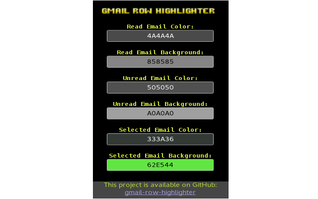

# gmail-row-highlight
Chrome extension for gmail row highlighting with keyboard shorcuts enabled.

**IMPORTANT/DEPRECATION The maintainer of this project no longer have time for it. If someone would like to take it it's free to take.**

  

You can download it for free: https://chrome.google.com/webstore/detail/gmail-row-highlighter/lcodjgpoghoileccehfoiiheicffmmia

The extension comes with simple popup which allows users to set up colors dynamically for read, unread and selected and their backgrounds respectively.
 

  

The project is open source licensed under the GPL-3.0 license.

Contributions and comments are welcome.

Please refer to the issues section of this repository with and bugs or feature requests.
